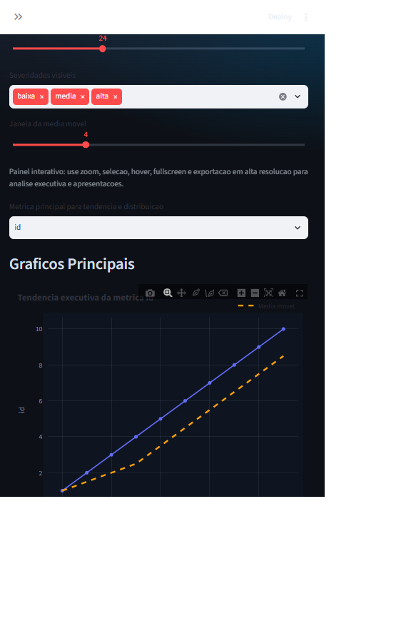
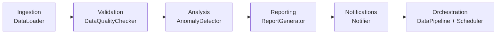

# DataSentinel

Pipeline automatizado de qualidade, analise e monitoramento de dados para operacoes criticas.

[](#instalacao-local)
[](#execucao-direta-1-minuto)
[](#exemplos-de-output)
[](.github/workflows/ci.yml)
[](LICENSE)

## Preview Visual

### Dashboard completo



### Area de graficos interativos


## Visao Geral

O DataSentinel executa um fluxo completo de confiabilidade de dados:

- ingestao de fontes CSV e API
- validacao de qualidade com regras configuraveis
- deteccao de anomalias e mudancas bruscas
- geracao de relatorios executivos em Excel e HTML
- notificacoes via Slack e email
- agendamento automatico com APScheduler

## Destaques do Produto

- dashboard Streamlit com experiencia visual orientada a BI executivo
- relatorio escrito automatico com diagnostico da planilha e recomendacoes
- analise de qualidade com score, regras YAML e perfil detalhado por coluna
- graficos interativos com zoom, exportacao em PNG, filtros e tabs analiticas
- exportacao de artefatos em Excel e HTML prontos para compartilhamento
- pipeline CLI e fluxo agendado para operacao recorrente

## Valor de Portfolio

Este projeto foi estruturado para demonstrar competencias que recrutadores e liderancas tecnicas costumam buscar em um desenvolvedor de dados ou software com visao de produto:

- engenharia de dados aplicada a ingestao, validacao e observabilidade
- analise exploratoria orientada a risco, qualidade e anomalias
- construcao de dashboard interativo com leitura executiva
- geracao de artefatos profissionais para tomada de decisao
- testes automatizados, CI e organizacao de projeto publicavel

## Competencias Demonstradas

- Python aplicado a pipeline analitico de ponta a ponta
- Pandas para carga, perfilamento e transformacoes tabulares
- Plotly e Streamlit para experiencia visual interativa
- validacao configuravel via YAML com regras de qualidade
- deteccao de anomalias e mudancas de comportamento em series numericas
- exportacao de relatorios em Excel e HTML
- CI com GitHub Actions, lint com Ruff e testes com Pytest

## Arquitetura



## Estrutura do Projeto

- src/ingestion: carregamento de dados (CSV/API)
- src/validation: validacoes de qualidade orientadas por YAML
- src/analysis: deteccao estatistica de anomalias
- src/reporting: relatorios Excel e HTML interativos
- src/notifications: alertas Slack e email
- src/orchestration: pipeline principal e scheduler
- tests: testes automatizados
- config: configuracoes e regras de qualidade

## Instalacao Local

### 1) Requisitos

- Python 3.11+
- pip

### 2) Instalar dependencias

```bash
python -m venv .venv
# Windows
.venv\Scripts\activate
# Linux/macOS
# source .venv/bin/activate

python -m pip install --upgrade pip
python -m pip install -e ".[dev]"
```

### 3) Configurar ambiente

```bash
copy .env.example .env
```

Preencha o .env com suas variaveis (Slack/SMTP/data source).

Campos do .env.example:

- `SLACK_WEBHOOK_URL`: webhook opcional para alertas Slack
- `SMTP_HOST`, `SMTP_PORT`, `SMTP_USER`, `SMTP_PASSWORD`: envio opcional por email
- `DATA_SOURCE_PATH`: arquivo padrao para execucao em CLI ou scheduler

## Execucao Direta (1 minuto)

### Opcao 1: Interface web (recomendado)

```bash
python -m pip install -e .
python -m streamlit run streamlit_app.py
```

Na tela inicial:

- envie um arquivo .csv, .xlsx ou .xls
- selecione a aba quando for Excel
- clique em Gerar relatorio
- visualize metricas, tabs analiticas, resumo escrito e diagnostico detalhado
- baixe os artefatos Excel/HTML

### Opcao 2: Script Windows pronto

```bash
run_app.bat
```

### Opcao 3: Pipeline em modo CLI

```bash
run_pipeline_once.bat
```

## Uso

### Executar uma vez

```bash
python main.py --once --csv-path dados_teste.csv
```

### Executar em agendamento por intervalo (ex: 1h)

```bash
python main.py --schedule --schedule-mode interval --interval-minutes 60 --csv-path dados_teste.csv
```

### Executar em agendamento diario (ex: 02:30)

```bash
python main.py --schedule --schedule-mode daily --daily-time 02:30 --csv-path dados_teste.csv
```

## Docker

### Build da imagem

```bash
docker build -t datasentinel:latest .
```

### Execucao com Docker Compose

```bash
docker compose up --build
```

O compose monta volumes locais para persistir:

- logs em logs/
- relatorios em reports/

## Exemplos de Output

### Relatorios gerados

- reports/report_YYYYMMDD_HHMMSS.xlsx
- reports/report_YYYYMMDD_HHMMSS.html

O Excel contem as abas:

- Resumo Executivo
- Perfil da Base
- Qualidade de Dados
- Anomalias Detectadas
- Dados Brutos

O HTML contem:

- cabecalho executivo com KPIs principais
- resumo escrito automatico da planilha
- perfil detalhado da base recebida
- tabelas de problemas de qualidade e anomalias
- graficos interativos para leitura executiva

### Exemplo de alerta Slack (resumo)

- DataSentinel - ALERTA URGENTE
- Status de Qualidade: FAIL
- Score de Qualidade: 60.00
- Problemas de Qualidade: 2
- Anomalias Detectadas: 2

## Principais Decisoes Tecnicas

### Great Expectations

Escolhido para escalar validacoes de qualidade com abordagem declarativa e auditavel. Mesmo com validacoes customizadas em pandas no MVP, o projeto ja tem dependencia pronta para evoluir para suites versionadas e data docs.

### APScheduler

Escolhido por simplicidade operacional para jobs em Python puro, com suporte a interval e cron sem exigir infraestrutura adicional no inicio.

### Loguru

Escolhido por configuracao enxuta e suporte nativo a logs estruturados em JSON, facilitando observabilidade local e futura integracao com stack centralizada.

### Plotly + openpyxl

- Plotly: visualizacao interativa para analise rapida de tendencia e anomalia.
- openpyxl: interoperabilidade forte com ambiente corporativo orientado a Excel.

### Pydantic Settings

Centraliza configuracao tipada via ambiente, reduzindo erro de runtime por variavel ausente ou tipo incorreto.

## Testes e Qualidade de Codigo

### Executar testes

```bash
pytest
```

### Cobertura minima no CI

```bash
pytest --cov=src --cov-report=term-missing --cov-fail-under=80
```

### Lint

```bash
python -m ruff check src tests main.py streamlit_app.py
```

## CI

O workflow em .github/workflows/ci.yml executa a cada push na main:

- lint com Ruff
- testes com Pytest e cobertura minima de 80%
- build da imagem Docker

Tambem executa em pull requests para reduzir regressao antes do merge.

## Licenca

Este projeto esta sob licenca MIT. Consulte o arquivo LICENSE.
